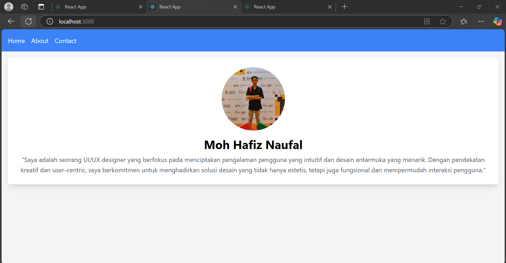
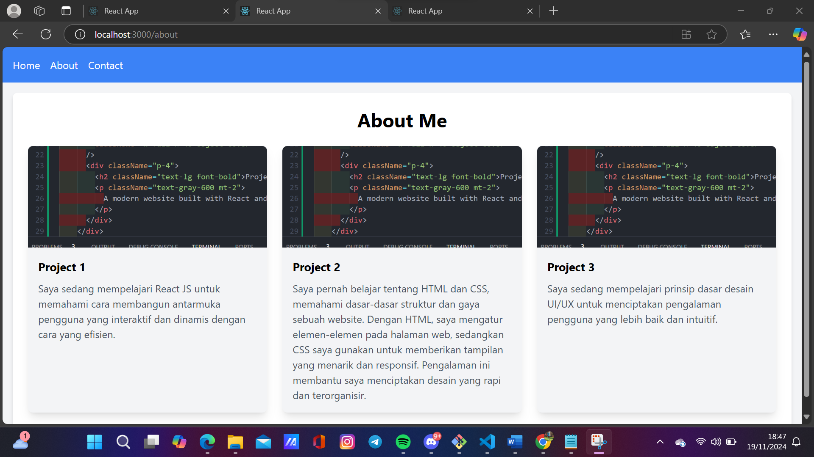
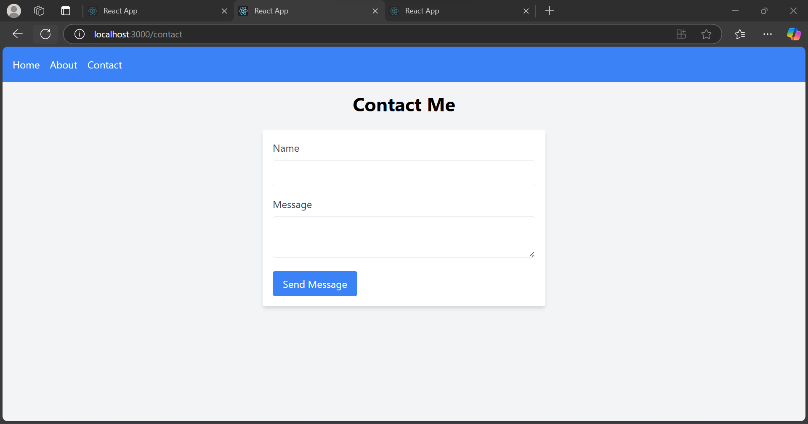

### `npm start`

Runs the app in the development mode.\
Open [http://localhost:3000](http://localhost:3000) to view it in the browser.

# Portfolio Website

## About
This is a portfolio website built with React.js...

